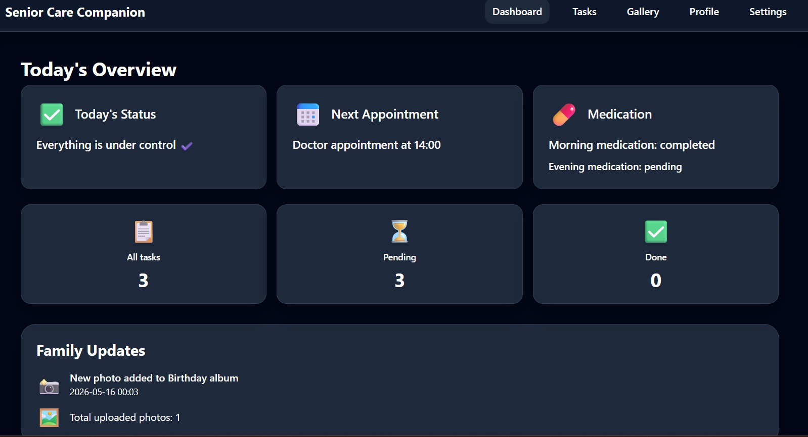
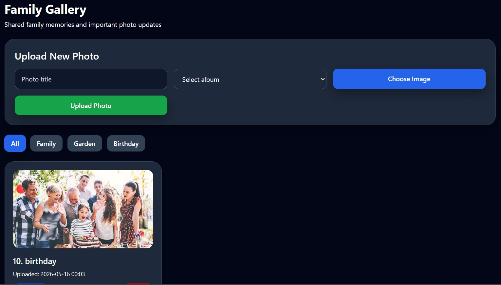
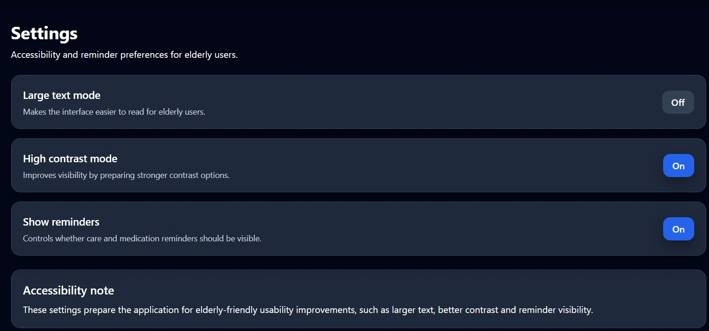

Senior Care Companion is an elderly-friendly healthcare companion web application built with F# and WebSharper SPA.

The application helps elderly users manage their daily care tasks and medication, reducing the risk of forgetting important activities or running out of essential medicine.

Icons were added to improve usability for elderly users.

Features: 
- Elderly-friendly modern UI
- Responsive desktop and mobile layout
- Dashboard with daily overview
- Care task management
- Medication reminders
- Task filtering (All / Pending / Done)
- Family photo gallery
- Album selection for uploaded photos
- Dashboard notifications
- Image timestamps
- Modal image preview
- Accessibility settings:
- High contrast mode
- Large text mode
- Local data saving with LocalStorage

## Screenshots

### Dashboard

### Gallery

### Settings

